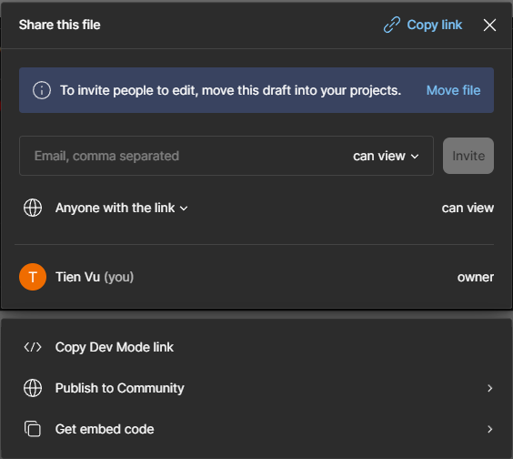

## Project Checkpoint

To make sure you're on the right track and will be ready for your demonstration, you will be required to submit a partial implementation by **Saturday July 13, 2024**. By this time, enough of your project should be working that you could do a small demonstration of your project and give us an idea of what will be done. **Essentially I want to see some working code at this point**

**I also require a Figma wireframe**. You can find Figma tutorials here

https://help.figma.com/hc/en-us/sections/4405269443991-Figma-for-Beginners-tutorial-4-parts

MIT Weblab's Figma content is also pretty good. Like their content if you find it helpful, many thanks for MIT for allowing us to use their stuff!

https://docs.google.com/presentation/d/1OeffI6QgBm1DMjcW2EFyo_jWej9BreemuRtgkJ2S6UU/edit

https://www.youtube.com/watch?v=jr7NT3JWMp8&ab_channel=weblab

To share the Figma link

## Submission

Your code must be in your group's Github repository

Create a Git tag for your submission something like this:

`git tag checkpoint`

`git push origin --tags`

For the checkpoint, you need to submit on Brightspace:

1. A Git tag link (+SHA + screenshot) for your project's code. As usual, take the screenshot of the commit history screen.

2. `readme.txt` with any notes you think are relevant to evaluating the code (to give us the best chance to see what you have working). This shouldn't be very long: a few paragraphs or points.

3. Figma share link. Tien must be able to view your Figma
