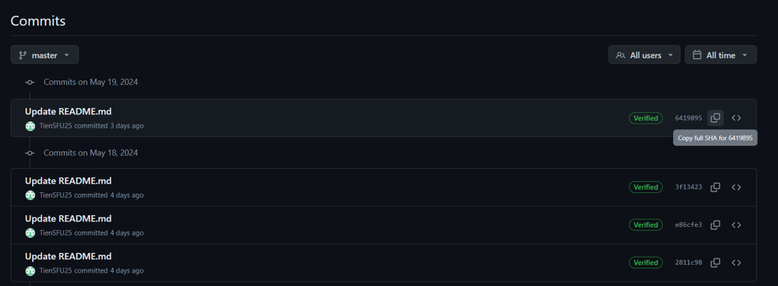

When submitting links to Github repos, we will use the following convention

1. the Github repo link

2. the commit SHA (or [tag](https://git-scm.com/book/en/v2/Git-Basics-Tagging)) of your latest commit
   Example: 641989540960f3fade07e346940a5aa330cd43dd

3. A screenshot of commits on your main branch that clearly shows the time of the SHA/tag

Example

https://github.com/TienSFU25/2650-weekly-exercises/commits/master/

Commit 641989540960f3fade07e346940a5aa330cd43dd

