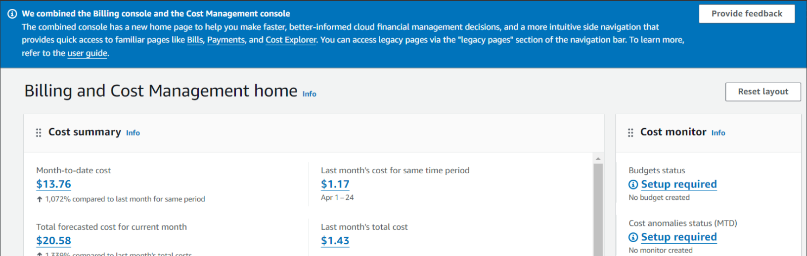
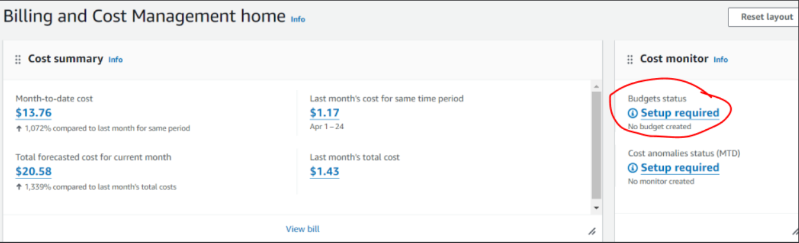
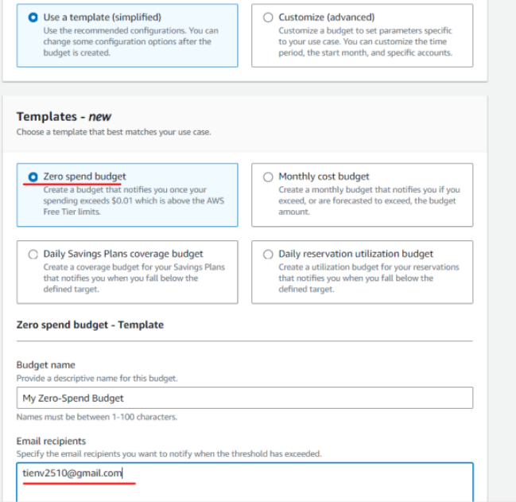
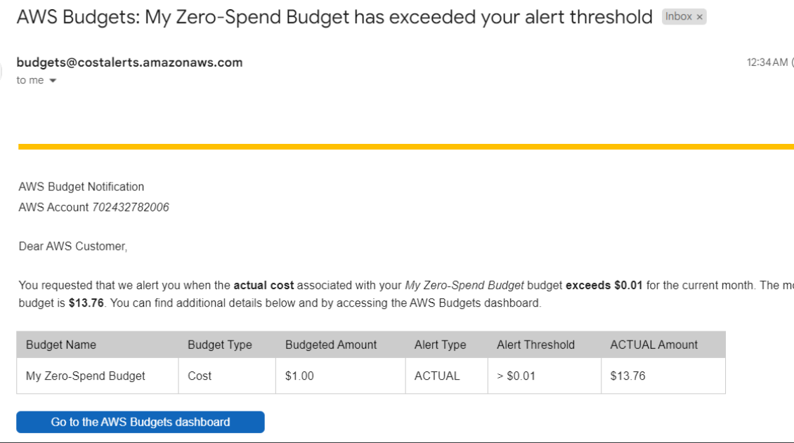

## Setup AWS Billing alerts

There's a confusing checkbox that you have to enable to allow IAM accounts to configure Billing settings, so lets just do this through the root account.

Go to https://us-east-1.console.aws.amazon.com/costmanagement/home?region=us-east-1#/home. My screen looks like this

I have some costs racked up because I've been playing with random services, the expectation is for you guys, you should be able to do things totally free.

Click on "Budgets status"

Select "Zero spend budget" template. Enter your email address and click "Create budget"

You could create more budgets if you wish. Since I already spent 13 dollars this month, I got an email like this

That's it!
