## "Deploying" a Docker app to EC2

For this exercise, you should be logging in using the IAM account

### Setup an EC2 instance

Follow the instructions here (steps 1 and 2 mostly) to setup an EC2 instance. **Make sure to select the free tier to avoid getting billed**

https://docs.aws.amazon.com/AWSEC2/latest/UserGuide/EC2_GetStarted.html

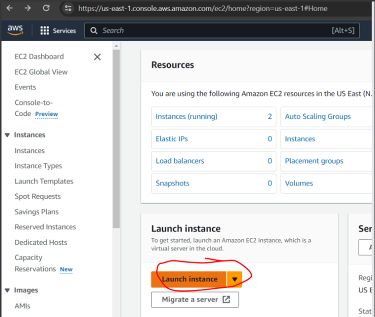

For `Application and OS Images`, select `Amazon Linux 2023 AMI`

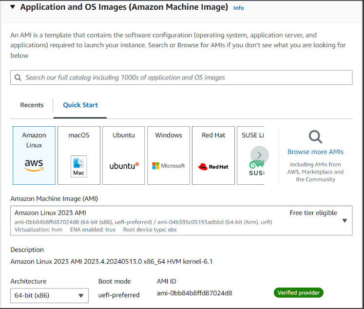

Select the `t2.micro` instance type. Create your key pair to login, and put it somewhere sensible. You will use this key pair to connect to your instance

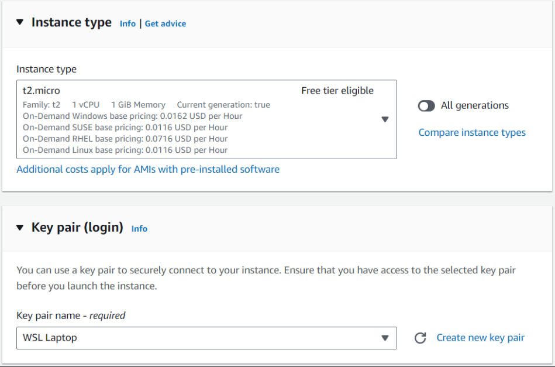

In Network settings, check the "Allow SSH traffic from" checkbox, and select "Anywhere". We'll come back to the security group stuff here in a bit

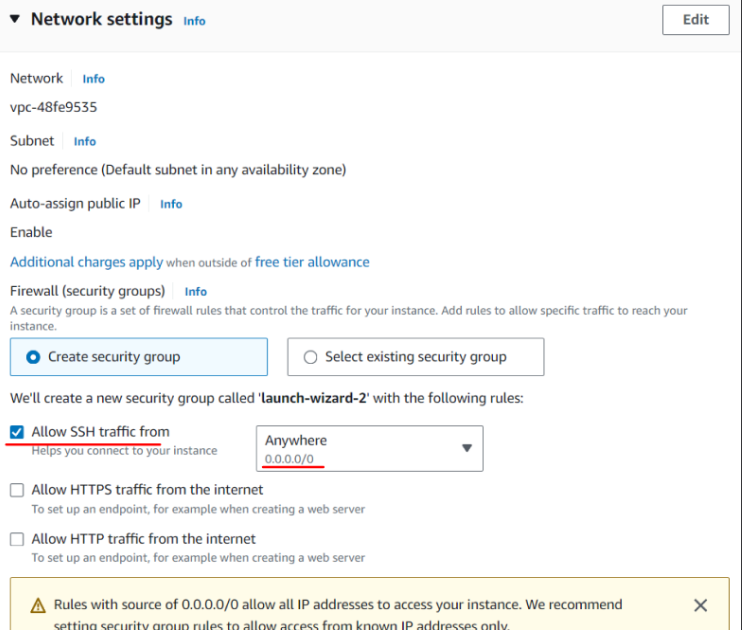

And then configure the smallest possible storage (8G)

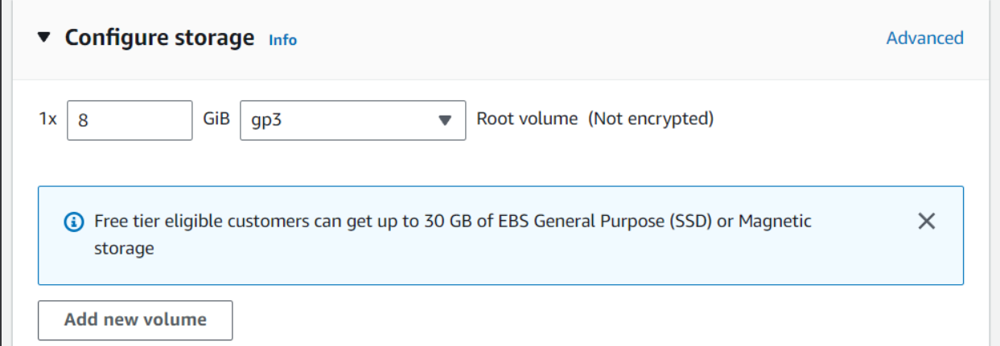

When all is said and done, you should be taken to the EC2 instance page

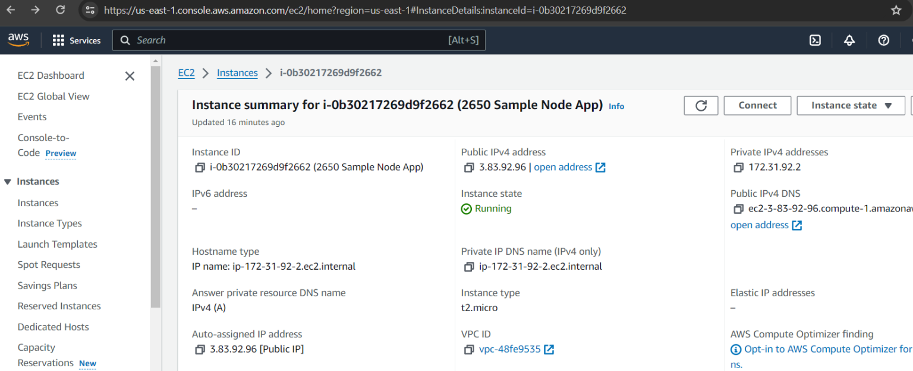

Click on the "Security" tab > Security group

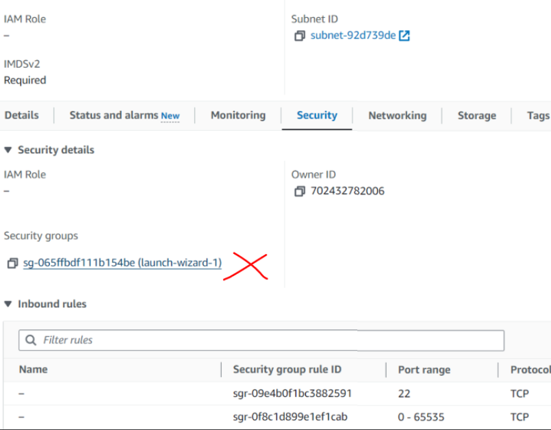

Click on "Edit inbound rules"

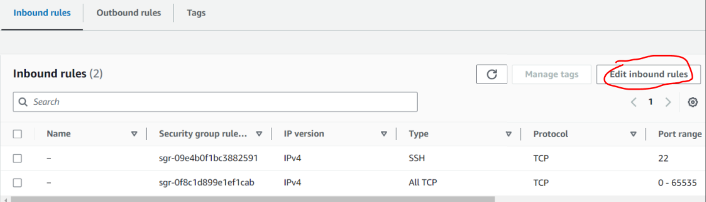

Make sure your security group allows Inbound connections using `SSH` and `All TCP`. You can either allow any Inbound connections from anywhere, or from just your IP. **Without this step, you won't be able to view your web application later**

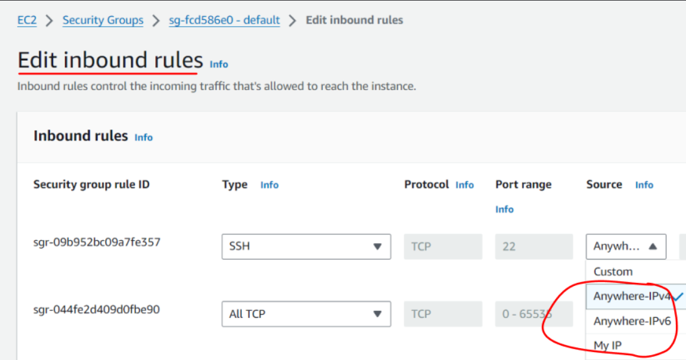

### Connecting to EC2

Now let's connect to your EC2 instance

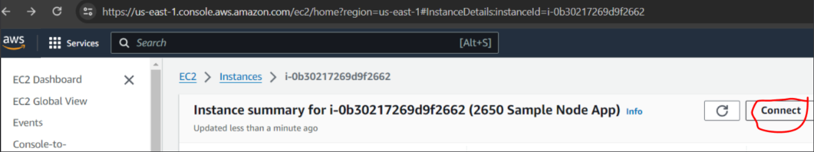

The command should look something like

`ssh -i "private_key.pem" ec2-user@ec2-\*\*\*.compute-1.amazonaws.com`

You are now "in" your EC2 instance. Try `pwd`

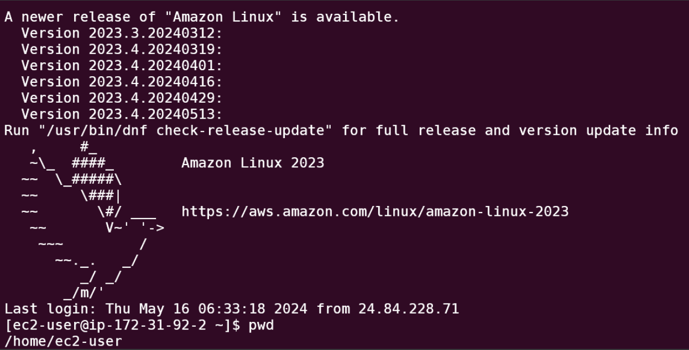

### Connect to the express-starter app

Install the following on your EC2 instance: `node`, `git`.

I usually get `node` by installing `nvm`: https://github.com/nvm-sh/nvm

Installing git

`sudo yum install git`

Now clone the following repo

https://github.com/TienSFU25/2650-express-starter

cd `2650-express-starter && npm i && node server.js`. In the instance page of AWS, find the public IPV4 address. Go to `{that_address}:3000`

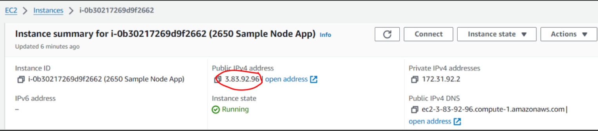

You should see the following

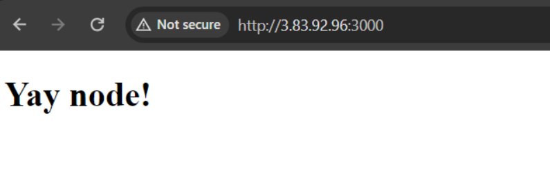

### Docker on EC2

Now lets try getting Docker to work on EC2.

Installing Docker
`sudo yum install docker -y`

Start the Docker service
`sudo systemctl start docker`

To enable the Docker service automatically when the instance starts
`sudo systemctl enable docker`

To run docker commands without sudo, add your user to the Docker group
`sudo usermod -a -G docker $(whoami)`

Note that the change to the user’s group membership will not take effect until the next time the user logs in. You can log out and log back in to apply the changes or use the following command to activate the changes without logging out

`newgrp docker`

Check that things work by typing `docker pull`

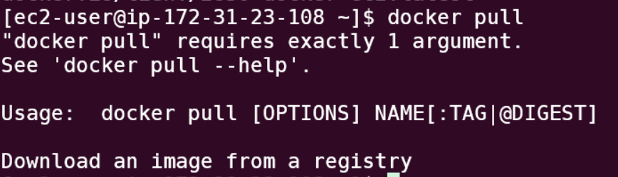

Now that `docker` is installed in the EC2 instance, **switch back to your local computer's terminal**

Clone the following repo

https://github.com/TienSFU25/2650-docker-ec2

**On your local machine**, `cd 2650-docker-ec2`, `docker build` and `docker run`. Read through the code and the `Dockerfile` to see how it works.

Now in the terminal (again, of your local machine)

`docker push {your_name}/2650-docker-ec2-exercise`

This pushes the docker image to Docker Hub. If you've done the docker [exercise](../docker-exercise.md), you should already be authenticated with Docker Hub to be able to push to Docker Hub.

Your task now is to figure out how to "pull" the `{your_name}/2650-docker-ec2-exercise` image onto the EC2 instance, and have it running on EC2 (instead of locally)

```bash
docker pull {your_name}/2650-docker-ec2-exercise
docker run -d -p 3000:3000 --rm {name_of_your_public_docker_image}
```

This link might help: https://www.linkedin.com/pulse/deploying-dockerized-apps-aws-ec2-yana-veitsman/
