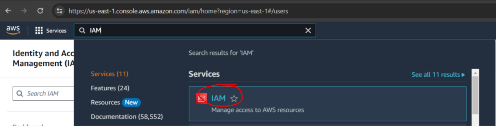

## AWS Setup

Lets setup an AWS account with an IAM Identity Center account. IAM best practices stipulates that you not use the `root` user for everyday tasks, rather you use IAM accounts with limited access.

> [!NOTE]
> IAM Identity Center !== IAM. Although for our purposes, they are pretty much the same. We will set things up for IAM Identity Center in this exercise.

Follow the steps to `Sign up for an AWS account` and `Create a user with administrative access here`

https://docs.aws.amazon.com/IAM/latest/UserGuide/getting-set-up.html#create-an-admin

> [!NOTE]
> You can setup MFA for your root user and all your IAM users. While not required for this exercise, I highly recommend setting up MFA for at least the root user as a security best practice.

The instructions on AWS should be all you need. Here's me posting some screenshots of my experience to maybe help folks who get stuck.

After creating an AWS account, you need to enable the `AWS IAM Identity Center`. This setups the platform where you register Users with their Emails, and grant them permissions.

After you've enabled `IAM Identity Center`, `https://us-east-1.console.aws.amazon.com/singlesignon/home` (or wherever your region is) should take to to a screen like this

Bookmark the AWS Access Portal URL (underlined in red), this is the link our IAM users will be logging in with

Now follow the steps here to create an actual User that we'll be logging in with
https://docs.aws.amazon.com/singlesignon/latest/userguide/quick-start-default-idc.html

Make sure that you've

- created the User `X`
- put `X` in `Admin Team` group
- created a Permission Set for `AdministratorAccess`
- Assigned the `Admin Team` the `AdministratorAccess` Permission set

Here's some screenshots after I finished things

Users page with one user `tiensIamAccount`

Groups page with `Admin Team` group

Assigning the `Admin Team` group the `AdministratorAccess` permission set

Now using the signon link earlier, logon to AWS using this test user

Click on `AdministratorAccess`

You're in! Verify that the logged in user shows AdministratorAccess/{your_account_name}

### Fallback to IAM

If you're having too much issues with IAM Identity Center, feel free to use traditional IAMs instead.

Sign in as the root user. Search for "IAM". This should take you to https://us-east-1.console.aws.amazon.com/iam/home?region=us-east-1#/users

On the sidebar, click `User groups`. Then click on `Create Group`

On the group creation page, name the group `Developers`. In the `Attach permission policies - Optional` section, select `AdministratorAccess`

Now let's create a `User` to put in this `Developers` group

In the User creation screen, be sure to

- check `Provide user access to the AWS management console`
- check `I want to create an IAM user`
- UNcheck `Users must create password`... Doesn't make a lot of sense if we set the password and reset it in 5 minutes

Add this user to the `Developers` group we created earlier. Click through to finish the flow

We're done! You can now log out of the `root` account, and sign in using the IAM credentials you just created. Note that you can also configure MFA separately for each IAM account.

**You might run into setup problems. Google / ChatGPT your way out of them!**
