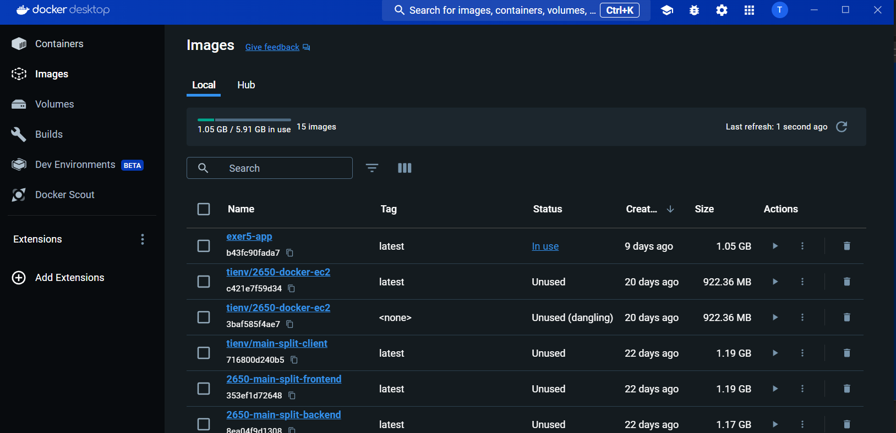
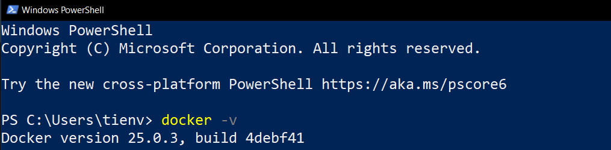
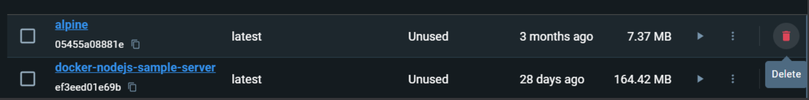
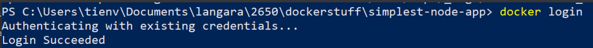
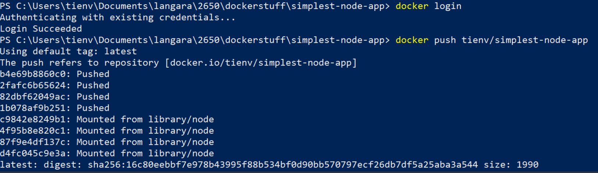

## Docker tutorial

### Installing Docker + Docker Desktop

Follow the instructions here to get Docker setup on your machine

https://docs.docker.com/get-docker/

I use Windows, so for me I have Docker Desktop



And I run Docker commands in Powershell. Make sure you're able to `docker -v` in a terminal somewhere and it works



Thanks Brian Kohler for allowing me to use his lab

https://www.koehler.ca/langara/202120/CPSC-2650/containers

I've tailored the instructions a bit, as we don't use GCP in this course.

### Creating a Container

In the terminal, run the following command:

`docker run --rm -it alpine`

`docker` is the Docker client program.
`run` is the subcommand used create a new container.
`--rm` is the option to remove the container when it exits.
`-i` or `--interactive` keeps STDIN open even if not attached.
`-t` or `--tty` allocates a pseudo-TTY. `-i` and `-t` are used together to create a container that we can interact with directly from the terminal.
`alpine` is the name of image upon which the new container is based.

If everything works, you should see a `#` shell prompt and should be able to use most basic shell commands such as `cd`, `ls`, `cat`, `cp`, `touch`, `echo`, `rm`, `mv` and `rmdir`.

Try the following:

```bash
cd /root
echo "Hello!" > first-file.txt
ls -la
cat first-file.txt
```

### Getting Information About Running Containers

**Note**: these instructions are for the command line. A lot of this could be found directly in the Docker Desktop GUI as well

Create a new terminal on the host.

Start another container in this new terminal:
`docker run --rm -it alpine`

Is `first-file.txt` present in the `/root` directory in this container?

Create yet another terminal on the host. Run the following command (ON THE HOST – not on the containers) to list the running containers:

`docker ps -s`

Run the following command to get streaming information on the running containers

`docker stats`

You will have to hit `Ctrl-C` to stop docker stats.

Stop one of the containers by entering `Ctrl-D` or `exit` on its terminal.

Confirm that the container has stopped by using `docker ps` or `docker stats`.

Stop the other container.

Where is `first-file.txt` now?

### Working with Images

You can get a list of locally available images using the following command:

`docker images`

Remember, if an image is a "Class", a container is "an instance of that Class"

If you are running out of disk space on your host, you can remove images that you are no longer using as follows:

`docker rmi {image_id}`

You could also press the Trash bin icon on Docker Desktop



### Mounting Volumes

Frequently we will have a directory of preexisting files that we would like to access inside the container or we end up creating files inside the container that we want to persist beyond the lifetime of the container. In this case, we can use the `-v` option to `docker run` to make a directory on the host available inside the container. The value of the `-v` option has the following form: `/path/on/host:/path/inside/container`.

For example, run following commands on the host:

```bash
mkdir site1
cd site1
echo '<h1>First Page!</h1>' > index.html
docker run --rm -it -v $PWD:/mnt/site1 -u 1000:1000 alpine
```

Inside the container do the following:

```bash
cd /mnt/site1
cat index.html
echo '<h1>Second Page</h1>' > page2.html
```

and then exit the container.

What is contained in the current directory on the host now? Take a screenshot

### Mapping Ports

The `-p` flag is used to forward ports on the host to a port inside the container.

### Creating Images

Up until this point, we’ve used existing images from the Docker hub registry. Lets try to make our own image

Clone the following repo https://github.com/TienSFU25/2650-docker-simplest-node. Inspect the content inside `index.js` and `package.json`. It should be straightforward to determine what this code is doing

Now we will build the image
`docker build -t {your_name}/simplest-node-app .`

And run a container
`docker run -p 3001:3000 --rm {your_name}/simplest-node-app`

The `-p` flag is used to forward ports on the host to a port inside the container. Verify that `localhost:3001` works as expected

### Working with a Container Registry

There are many Docker registries to publish your images. We'll just use [Docker Hub](https://hub.docker.com/) for now. Create a Docker Hub account if you don't already have one

If this is the first time you are pushing an image, the client will ask you to login. Provide the same credentials that you used for logging into Docker Hub.



To publish your image, `docker push {your_name}/simplest-node-app`



Verify that your image is in Docker Hub by doing to https://hub.docker.com/repositories/

Now remove the local copy of your image

`docker image rm {your_name}/simplest-node-app`

And try to create a container using that image

`docker run -p 3001:3000 --rm tienv/simplest-node-app`

Docker will give the warning "Unable to find the image.... locally", then proceeds to fetch the image from Docker Hub to create your container.

Verify it works at `localhost:3001`
