## MongoDB Atlas Tutorial

Disclaimer: this tutorial is a mish-mash of Jordan Miller's Mongo tutorial, with some modifications of mine. If some screenshots in here don't make sense (Jordan's Mongo version was a bit older), try your best to infer from context.

The official docs to get this setup are here: https://www.mongodb.com/docs/atlas/getting-started/

We're going to set up a new database using MongoDB's database-as-service service, Atlas. Go to https://www.mongodb.com/cloud/atlas

Click the green Try Free button. (If you have concerns about your private information being stored on a server outside the country, please feel free to use a pseudonym, or let me know and we can figure something out.)

Then sign up for a free account:

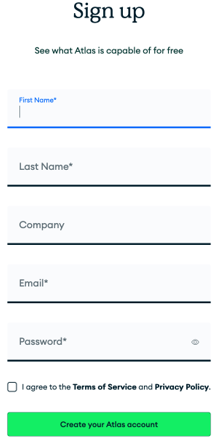

You'll have to login to your email to verify the signup. Once you've done that, you may see a welcome screen with a few questions about who you are and why you're using MongoDB. Feel free to answer these according to your preferences, and click Finish.

You will be asked to choose a deployment option. Choose the Shared option, which is free, and click Create:

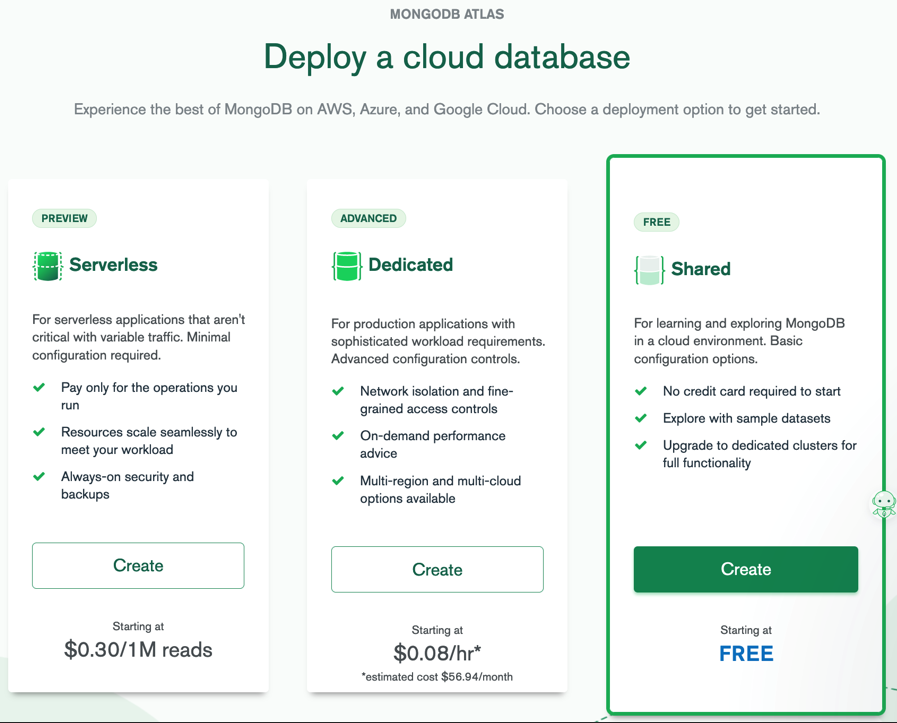

You will then be asked to choose a cloud provider and region. You can leave AWS as the default provider, and choose either of the USA options for region. There are a few other options below, but you can keep the defaults and click Create Cluster. (You may see a more recent version of MongoDB than the screenshot below, which is fine.)

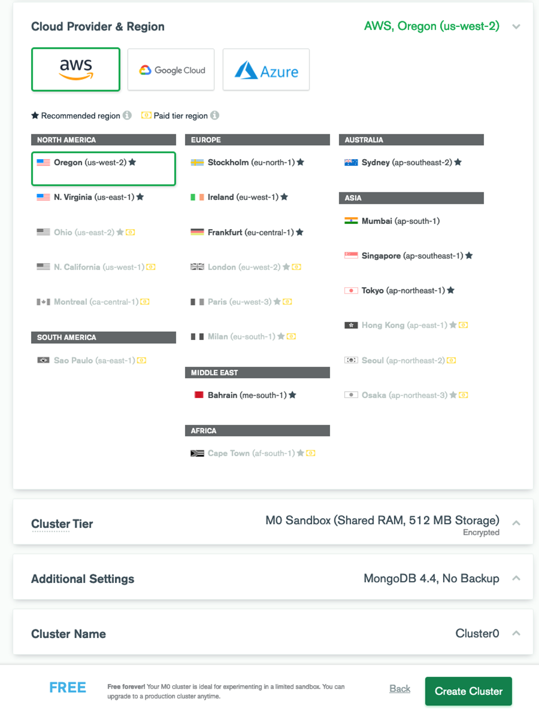

You should see a message that says "M0 Cluster Provisioning..." This should only take a few minutes.

While that's happening, you'll see a few configuration options that you can set. For the first option (regarding authentication), you can choose Username and Password:

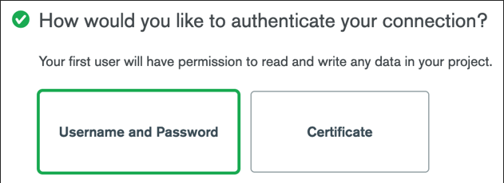

Beneath that, you should see the following form to create a user. Go ahead and fill that out. **Write down the password, you'll need it later**.

The next option is about setting up your connection IP. Choose My Local Environment (this will work even if you're developing using Cloud9).

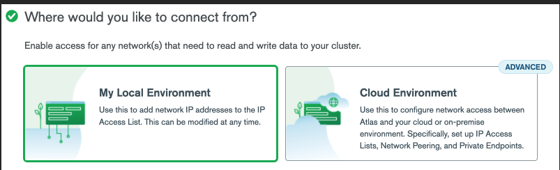

Next, you'll be prompted for the IP address that you'll be connecting to your database from. We'd like our database to accept connections from anywhere (not recommended in production, but fine for learning and practicing), so enter the IP address 0.0.0.0/0 and click Add Entry:

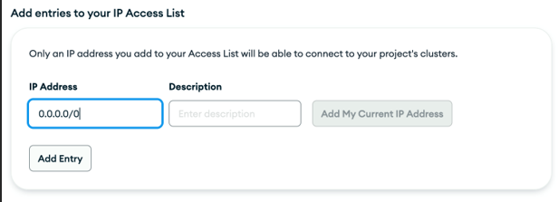

Then click Finish and Close. You should see an alert that says "Congratulations on setting up access rules!". You can click Go to Databases.

You should now see the following screen:

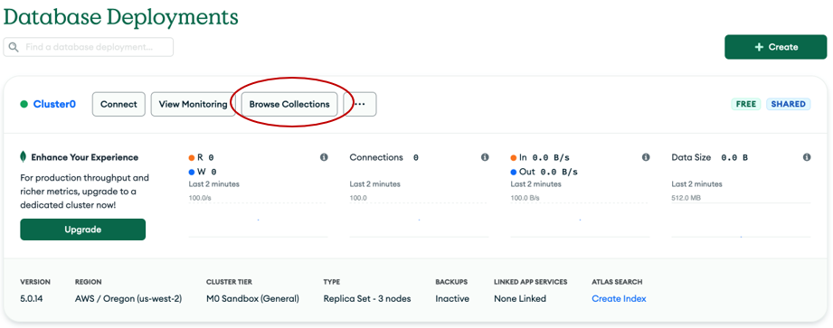

## Setup test data

Click on Browse Collections. Since you don't have any collections yet, you'll see this:

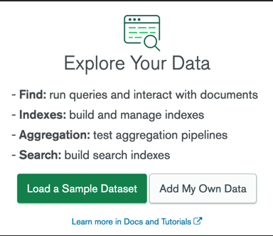

Click on "Load a Sample Dataset". For me this created the `sample_mflix` dataset

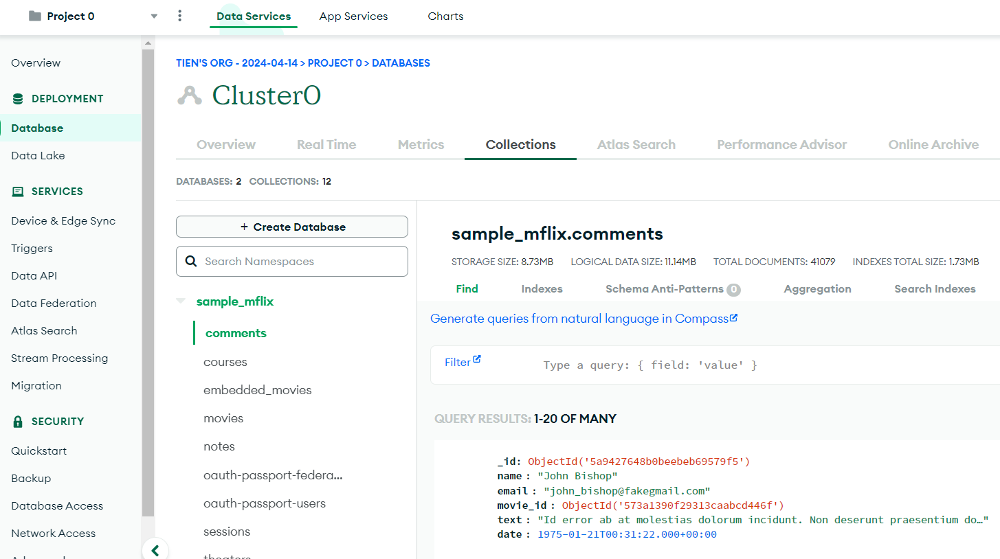

Now click on the Overview tab. you should see something like this:

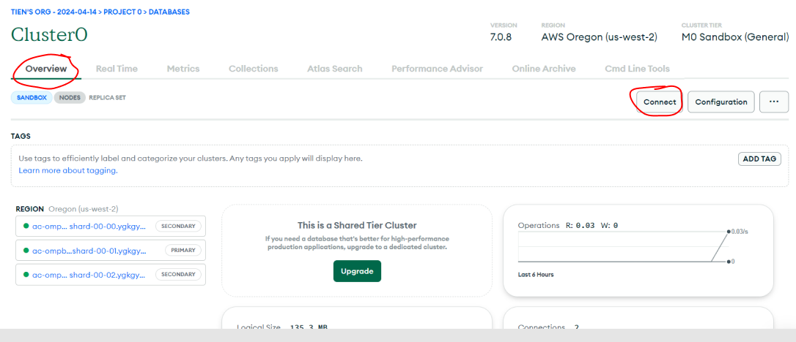

Click CONNECT. Select "Driver". You should see this:

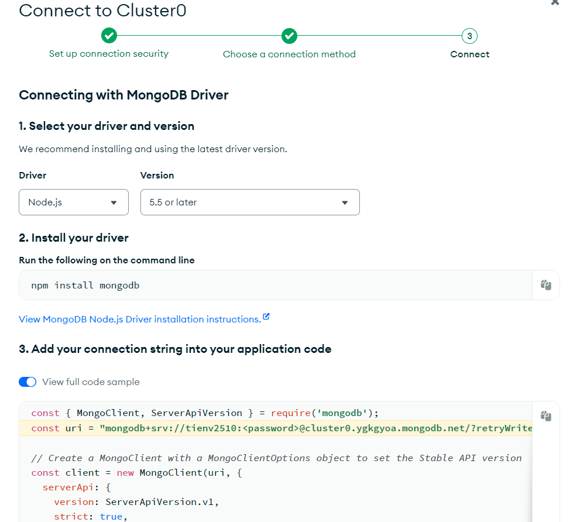

Put that sample code in a Node file, change the `<password>`, run it to see that things work.

### dotenv setup

Lets get that `password` out of the Node file. Using [dotenv](https://www.npmjs.com/package/dotenv), I like to store the entire Mongo connection string `mongodb+srv://<yourname>:<password>@cluster0.ygkgyoa.mongodb.net/?retryWrites=true&w=majority&appName=Cluster0"` inside an `.env` file like this

```js
MONGOURI =
  "mongodb+srv://<yourname>:<password>@cluster0.ygkgyoa.mongodb.net/?retryWrites=true&w=majority&appName=Cluster0";
```

Then in a Node.JS file

```js
import "dotenv/config.js";
import { MongoClient } from "mongodb";

const uri = process.env.MONGOURI;

const client = new MongoClient(uri);

async function connectToMongo() {
  try {
    await client.connect();
    console.log("Connected to the MongoDB database");

    global.db = client.db(process.env.MONGODBNAME);

    const movies = await db
      .collection("movies")
      .find({ title: { $regex: "Despicable", $options: "i" } })
      .project({ title: 1 })
      .toArray();

    console.log(movies);
    debugger;
  } catch (err) {
    console.error("Failed to connect to MongoDB", err);
  } finally {
    await client.close();
  }
}

connectToMongo().catch(console.dir);
```

Make sure you see 2 Despicable Me movies printed. We're done!
