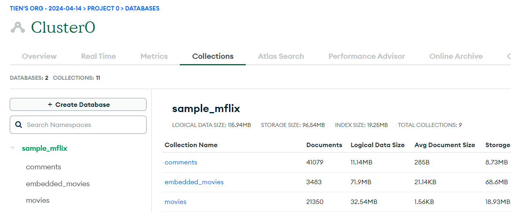
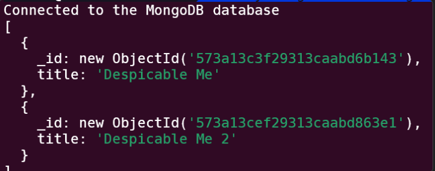

## MongoDB

Lets play with Mongo "straight up" first. We'll get back to Mongoose later in the exercise.

If you don't have Mongo Atlas setup, follow the instructions [here](mongo_atlas_setup.md). If you already have it setup, make sure that you have the [sample_mflix](https://www.mongodb.com/docs/atlas/sample-data/#std-label-load-sample-data) dataset loaded. It should look like this



Create a new directory `mongo_test`.

`npm init, npm i --save dotenv mongodb`

Copy paste [mongo_test.js](mongo_test.js) into a local file. Name it `mongo_test.js`

Configure your `.env` with the appropriate `MONGO_URI` (the connection string `mongodb+srv://...`) and `MONGODBNAME` (I just have MONGODBNAME="sample_mflix" )

```js
// .env file
MONGO_URI = "mongodb+srv:..."; //...the Mongo connection string
MONGODBNAME = "sample_mflix";
```

Run `node mongotest.js`. You should see the following



You can think of the MongoDB find method as consisting of three parts

1. `collection`: similar to SQL's `FROM`, this tells us which "tables" to look in
2. `find`: similar to SQL's `WHERE`. Our `{ title: { $regex: "Despicable", $options: "i" }}` query looked for movies where the title contained "Despicable"
3. `project`: similar to SQL's `SELECT`. `project()` gives you all the fields, `project({title: 0})` gives all fields except title, and `project({title: 1})` gives you only the title

### Exercise 1

In `mongo_test.js`

a. Find all movies released after the year 2000

b. Find all distinct languages in all movies

c. Find all PG-13 movies casting Ryan Gosling , sorted by release date

d. Find number of movies per genre. Take a look at Mongo's aggregation pipeline [docs](https://www.mongodb.com/docs/manual/aggregation/). You'll also probably want `$unwind` here

e. Insert a movie. Give it whatever title you want, and your name as the Director

Your code in `mongo_test.js` should be structured so that one function clearly maps to one question. I've put some boilerplate in there for parts a and b already.

## Mongoose (Exercise 2)

Now lets see what Mongoose is able to do. Same setup, copy [mongoose_test.js](mongoose_test.js) into a local copy. Write functions `e2a, e2b, e2c...` for these

a. Find all movies released after the year 2000

b. Find all distinct languages in all movies

c. Find all PG-13 movies casting Ryan Gosling , sorted by release date

d. Find number of movies per genre. Same aggregation as in Mongo, just slightly different syntax

e. Programmatically insert a movie with {your_name} as the Director, year: 2000. Make sure the other fields match up with the schema.

f. Now try inserting a movie with the `year: "whatever"`, with `{your_name}` as the Director. Did that work? **Take a screenshot** of the error.

g. Now change the year schema from `{ type: Number }` => `year: { type: String }`. Add the `year: "whatever"` movie again. Keeping the `year: {type: String}` schema above, write a query to get all movies where `{your_name}` is the Director. What happened to the original movie that was in `year: 2000`? **Take a screenshot**

Note: you do not need to write a new function for `e2f`. Use the same insertion code as in `e2e`.

h. Before you submit, make sure to revert the schema back so that the `year` is a `Date`.

## Submission

1. `mongo_test.js` with 5 functions as answers
2. `mongoose_test.js`with 6 functions as answers, and 2 screenshots
