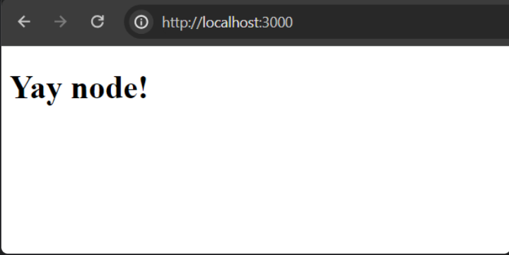
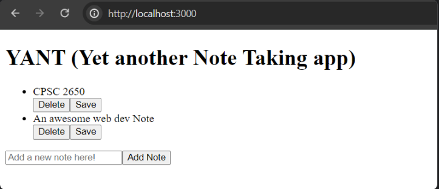

## Node exercise

We're going to plumb together a basic CRUD app in Node. Not the most exciting thing on earth, but it's a chance for you to review how things work in Express. And even though we will "graduate" to using ReactJS, many JS libraries still require you to interact with DOM elements (Google Maps API, D3 for example). So we'll explore some good ol' DOM manipulation in this exercise as well.

NOTE: we will come back to build on top of this exercise later on in the course. Make sure you complete it!

### Setup

Clone the following repository
https://github.com/TienSFU25/2650-express-starter

`npm i` and verify that stuff runs by `nodemon -L server.js` and going to `http://localhost:3000`



Poke around `server.js` to remind yourself of how Express apps are structured.

### Step 1: Add some UI

We're going to just hold our "notes" in memory. Usually we store stuff in a DB but this is a course 🤷

Create a file `persistence.js` in the root directory. Put in this code

```js
let _notes = [
  { id: "2", text: "CPSC 2650" },
  { id: "1", text: "An awesome web dev Note" },
];

// TODO: implement addNote and removeNote
// For fun: why do we export a function instead of notes directly?
const notes = () => _notes;

export { notes };
```

Notice that (recent) industry convention is to not prefix "getters" with "get". Hence `notes` instead of `getNotes`.

Likewise, copy paste this in `index.pug`

```
extends layout

block content
  h1= title

  div(class="container")
    ul#notes
      each note in notes
        li
          div= note.text
          button.delete-btn(type="button" data-id=note.id) Delete
          button.edit-btn(type="button" data-id=note.id) Save

    form(method="POST" action="notes")
      input(type="text", name="noteText", placeholder="Add a new note here!")
      button(type="submit") Add Note
```

Using `persistence.js`, make changes to `index.js` so that we could see all the "Notes" on the homepage



### Step 2: Implement the "data layer"

See Data Access Layer in Node [example](https://akhilkumarpenugonda.hashnode.dev/creating-a-data-access-layer-with-mongodb-in-nodejs).

Implement `addNote`, `editNote` and `removeNote` in `persistence.js`. **Export these 3 functions** out of this file, we will use it for the next step

### Step 3: Add a note

If you click on the "Add Note" button now, you will get a 404 because `POST /notes` is not handled by the Express backend yet. So let's add this route.

First, `npm i --save uuid`. This is to generate unique IDs. You can use this library by

```js
const { v4: uuidv4 } = require("uuid");
const id = uuidv4();
```

In server.js, add this code

```js
import notesRouter from "./routes/notes.js";
app.use("/notes", notesRouter);
```

Then in `routes/notes.js`, add a route for `router.post("/")`. This handler would deal with POST requests going to `/notes`.

Use `req.body` to grab data off the form. Test to make sure that note adding functionality works

### Step 4: Delete a note

I want you to do this part using "just" Express with pure client-side Javascript.

- in `views/layout.pug`, add `script(src="/javascripts/script.js")` after the CSS link

- Under `public/javascripts`, add a `script.js` file. We should be able to run JS on the client now

- Note: client side JS it NOT the same as the server-side JS we've been writing so far.

At this point you should have enough pieces to figure out how to do deletion, by adding to script.js and making appropriate server-side changes. Hint

- `document.querySelectorAll` to grab the deletion buttons
- `button.getAttribute` to grab the note IDs
- `button.addEventListener("click")` to attach event handlers
- `fetch(), { method: "DELETE" }` to send the request to backend
- `req.params.id` to grab data (see Express routing)

### Step 5: Edit a note

Edit is slightly more complex, as we need the note ID to edit, and the new note text. My hint for this is to use [contentEditable](https://developer.mozilla.org/en-US/docs/Web/HTML/Global_attributes/contenteditable). Feel free to get as creative as you'd like!

### Step 6: Add Styling

Aim to spend ~15 minutes for this task. The styling does not need to be fancy, just use some of the stuff from last class/lookup methods to get the page to look more like a 21st century website.

### Submission

Submit the link to your Node repo (+SHA + screenshot). `npm i && nodemon server.js` should be all is needed to get your Node app up and running
