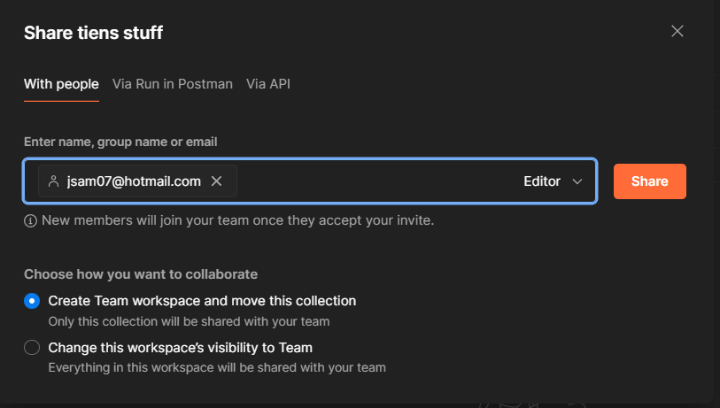

## Redis

Make sure you have Redis installed - [Redis installation docs](https://redis.io/docs/latest/operate/oss_and_stack/install/install-redis/).

> [!IMPORTANT]
>
> For folks on Windows - see [options for installation](redis_in_windows.md)

### Connect Express with Redis

```js
import redis from "redis";

let redisClient;

(async () => {
  redisClient = redis.createClient();

  redisClient.on("error", (error) => console.error(`Error : ${error}`));

  await redisClient.connect();
})();

await redisClient.set("foo", "bar");
const cachedData = await redisClient.get("foo");

console.log(cachedData);
```

Read through this guide.

https://www.digitalocean.com/community/tutorials/how-to-implement-caching-in-node-js-using-redis

### The actual exercise

Let's mock some Mongo functions. Using the Mongo stuff you learned last week (with the `sample_mflix` dataset), create a Node server with the following endpoints:

1. `GET /movies`:  Get the first 10 Movies
2. `GET /movie:id`: Get one Movie by its ID
3. `PATCH /movie:id`: Update one Movie's title by its ID
4. `DELETE /movie:id`: Delete a movie by its ID

You could start with the Node skeleton repo: https://github.com/TienSFU25/2650-express-starter

Now, integrate a caching mechanism onto these 4 endpoints. We want to do both *write-through* and *cache-aside*. Think about how this is going to be done.

- What should the cache store? The Movie object in Mongo is pretty large, for the sake of this exercise let's pretend all we care about for a Movie are its `id`, `name`, and `title`.
- When should we write to the cache? If we just grabbed Movie 5, do we need to visit the DB to get Movie 5 again?
- When should we invalidate the cache? Assume nothing else interacts with this Mongo database, and Movies are only changed through our Mongo function above.

## Postman

Sign up for Postman. Figure out a way to blackbox test the caching performance above.

> [!TIP]
>
> Hint: For me, querying the same movie via MongoDB Atlas takes ~ 50ms (**Figure 1**) while querying Redis takes ~ 5ms (**Figure 2**).

**Figure 1**: Mongo Response Time


**Figure 2**: Redis Response Time


So there must be a way to test that.

> [!TIP]
>
> You can use `pm.response.responseTime` for benchmarking - see [Postman docs](https://learning.postman.com/docs/writing-scripts/script-references/test-examples/#test-response-times).

---

Add Jamie as a contributor to your Postman Workspace: jsam07@hotmail.com



## Submission

1. GitHub link to the Redis exercise
2. Postman workspace shared with Jamie's account

## Grading

- 3/3: "nice!"
  - Exceptional work with all tasks completed satisfactorily according to the specification
  - Efficient, well-designed, and well-coded
- 2/3: "satisfactory"
  - Most tasks completed, but a few key things missing
  - Some inefficiencies in the implementation, or deviation from the specification
- 1/3: "it barely works"
  - Some progress made, but major deficiencies in solution
  - Many tasks missed or major deviation from specification
- 0/3: "you didn't do much"
  - Little or no progress
  - Few points from specification implemented

Note that up to -0.5 may be deducted for improper hand in, disorganized files or code, etc. Please ask me if in doubt.
