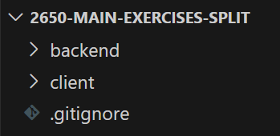
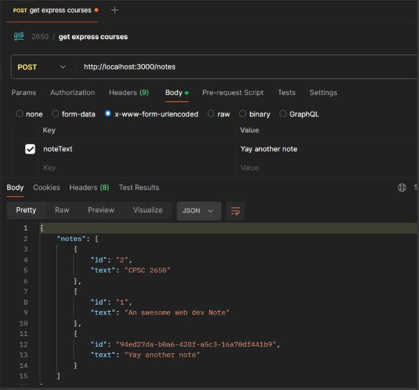
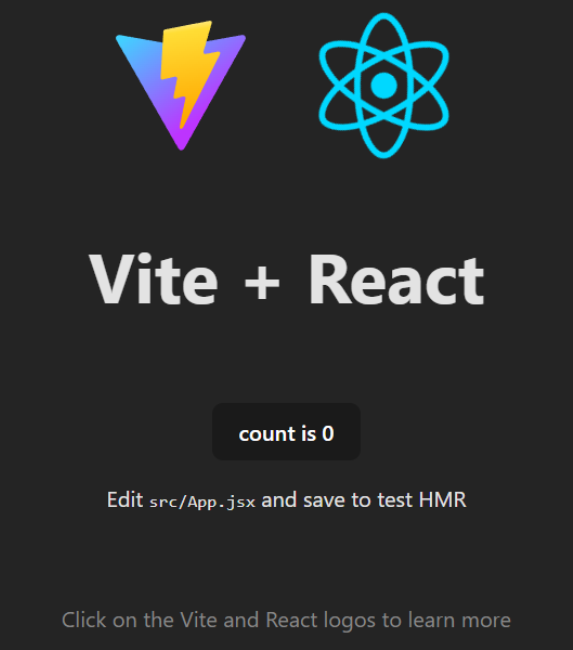
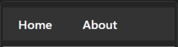
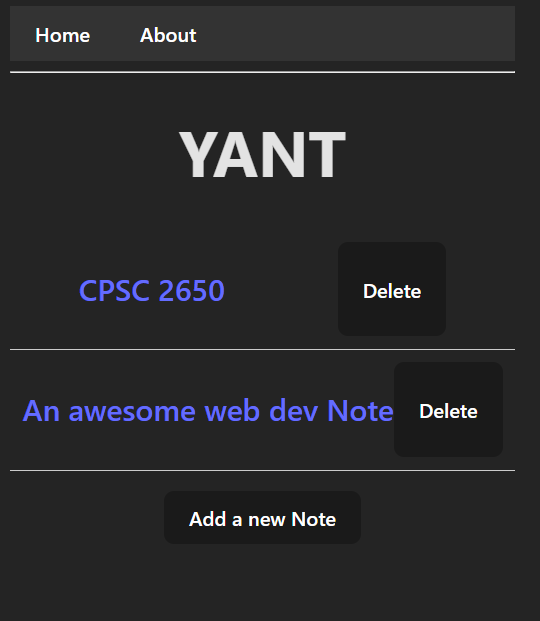
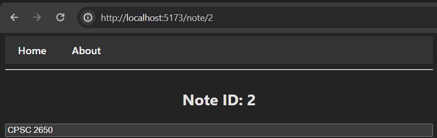
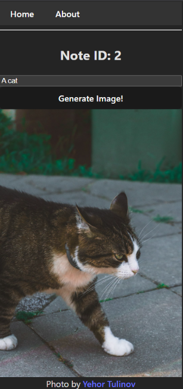
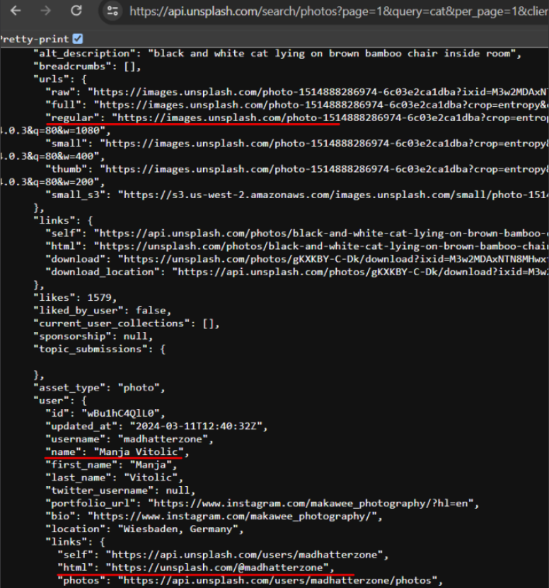

## React

For this exercise, we will be connect a Node "backend" with a React frontend so that things resemble a Single Page Application.

### The structure



- The backend: contains JSON based API
- Client: connects to the backend

You can assume that we will run the backend and client separately as two processes.

### API Server

Create a JSON based REST API on a Node server that serves the following endpoints. Copy paste as much code from W4 (the Node exercise) as you need. This includes

1. `POST("/notes")`

2. `DELETE("/notes")`

3. `PATCH("/notes")` (or `PUT`, whichever HTTP method you used for "edit")

4. `GET("/notes")`. This is a new endpoint

You can test that these API endpoints work using Postman. I tested using `x-www-form-urlencoded`, but I believe `form-data` will also work



#### CORs

We'll be sending requests from React to Node from different ports. By default, the browser enforces the `Same-Origin Policy`. This policy restricts web pages from making requests to a different origin (domain, protocol, or port) than the one that served the page.

To resolve the CORS issue, you need to configure your server (running on port 3000) to include the appropriate CORS headers in its responses.

`npm i --save cors`

Then in `server.js`

```js
import cors from "cors";
app.use(cors());
```

### Render the notes in React

Use [Vite](https://vitejs.dev/guide/) to generate the React boilerplate to get things started. The command you'll want is

`npm create vite@latest my-vue-app -- --template`

Verify that http://localhost:5187/ takes you to the Vite prebuilt App component



Using the React Router [basic example](https://github.com/remix-run/react-router/tree/dev/examples/basic), create a basic nav bar with `Home` and `About`



On the "Home" page, show ALL the Notes by `fetch("/notes")`. You'll want to use `useEffect` to handle the initial data loading, and `useState` to store the Notes in React

Similarly, handle Note addition and deletion by requesting the backend's other `/notes` routes

Fetch documentation: https://developer.mozilla.org/en-US/docs/Web/API/Fetch_API/Using_Fetch. Note the use of body: `JSON.stringify(data)`

The final result should look something like the following



### Edit Note page

Make it so that you can click on each of the notes. Each note would go to a link like `/note/:id`

Change the React form so that you can edit the Note text from this page. The edits here should go to the `PATCH("/notes")` endpoint you implemented earlier. I just used `<input>` like this



### Integrate with Unsplash

> [!CAUTION]
> Legal Disclaimer
> Students are required to read and adhere to the Terms of Service and usage guidelines of any external API they use. Misuse of APIs, including violations of terms and conditions, is the responsibility of the student. The instructor and institution are not liable for any legal issues arising from improper use of third-party APIs.
> You can find the Unsplash terms of service [here](https://unsplash.com/terms).
> API terms [here](https://unsplash.com/api-terms).

We will add images from Unsplash based on the text in the Note



Sign up for your account here
https://unsplash.com/documentation#creating-a-developer-account

How to search for a photo
https://unsplash.com/documentation#search-photos

Your search request will look something like this. I highlighted the important parts in red



I will let you figure out how to do this. General requirements/hints

- You'll need to expand the Note "schema" to include some more fields
  - The image URL
  - Image author (name + link)
  - Show these new fields on the client accordingly
- The "Generate image" button should search based on the current Note text
- To use Unsplash, you need to use the Access key provided in https://unsplash.com/oauth/applications/{your_app_number}. **This Access key must only be used from your backend, and not be exposed in the browser**. Use `node-fetch` to send requests, and `.env` to store the Access key
- Make sure you attribute the author (user info should be in the API response)

## Submission

Github repo (+ SHA + screenshot)

## Checklist

- [x] Nav bar works properly
- [x] All notes show on the homepage
- [x] CRUD note works
- [x] Unsplash part works WITHOUT exposing secret key to browser
- [x] BONUS: can you implement some form of caching to reduce the # API calls to Unsplash?

## Grading

- 4/3: everything in 3/3, AND you completed the BONUS caching part to reduce API calls
- 3/3: "nice!"
  - Exceptional work with all tasks completed satisfactorily according to the specification
  - Efficient, well-designed, and well-coded
- 2/3: "satisfactory"
  - Most tasks completed, but a few key things missing
  - Some inefficiencies in the implementation, or deviation from the specification
- 1/3: "it barely works"
  - Some progress made, but major deficiencies in solution
  - Many tasks missed or major deviation from specification
- 0/3: "you didn't do much"
  - Little or no progress
  - Few points from specification implemented

Note that up to -0.5 may be deducted for improper hand in, disorganized files or code, etc. Please ask me if in doubt.
