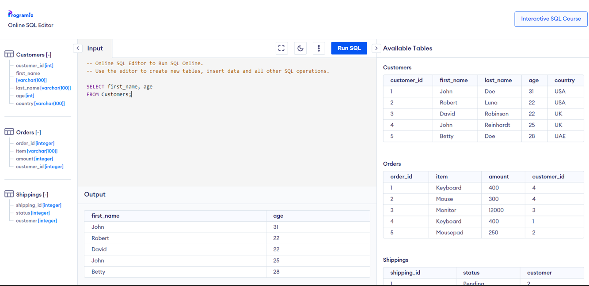

## SQL

< [!NOTE]
< This first part is optional, and is meant to help you review SQL. It looks like most students have had experience with SQL however, so feel free to skip it

We will play with SQL via this online SQL compiler: https://www.programiz.com/sql/online-compiler/. You should see the following three tables “Customers”, “Orders” and “Shippings”

Write a SQL query that returns… (take a screenshot of the relevant table after each question)

- Last name, first name, and age for all Customers ordered by last name
- First name and last name of all Customers who live in USA
- Insert into “Shippings” a “Pending” order to Customer 6
  - Why does this query fail?
  - What would happen if we tried this in NoSQL e.g MongoDB?
  - What do we need to do to make this query work? Write out the missing query
- Change all Customer’s with the country “UK” to “England”
- Delete all Pending Shippings

## SQL Data modeling

Describe a SQL schema to support a Learning Management System, where

- Students are enrolled in Courses
- Courses have Lessons, and Assignments
- Assignments have Submissions. Each Submission belongs to one Student

Here are the Tables. **Describe the primary keys, and foreign key relationships**

- Students (should be Users but lets pretend there are only Students)
- Courses
- Enrollments
- Lessons
- Assignments
- Submissions
