## OIDC

In this exercise, we will use OpenID Connect to implement authentication with Google. We will somewhat follow this tutorial. They use MySQL, which we will replace with MongoDB and Redis

https://www.passportjs.org/tutorials/google/

### Prereq 1: Explore how Express handles Sessions

Documentation [here](https://expressjs.com/en/resources/middleware/session.html)

I made a simple demo for this here
https://github.com/TienSFU25/2650-express-session-demo/blob/master/README.md

Follow the stuff in the `README` of the demo repo to understand how Sessions are tied to Cookies. Remember, a "Session" uniquely identifies a user using the web application. HTTP is stateless, so in order to know "who's this person", we send additional Cookies with each request. For this example, we store session data in memory, in production environments we'll want to store in more persistent places like [Redis](https://www.npmjs.com/package/connect-redis).

### Prereq 2: study how the OIDC example works

I found it most useful to just clone a working example first, run it, and try to reverse engineer what's going on

https://github.com/passport/todos-express-google

> [!NOTE]
> ["Todos-express-google"](https://github.com/passport/todos-express-google) by [Jared Hanson](https://www.jaredhanson.me/) is licensed under the [Unlicense](https://unlicense.org/)

You'll need a GCP account to setup OAuth2 credentials under "APIs and Services"


The final configuration should look like this (url is at https://console.cloud.google.com/apis/credentials?project=curious-ocean-290110)

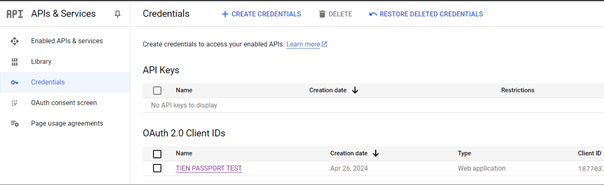

You can find documentation to setup Google here
https://developers.google.com/identity/openid-connect/openid-connect#appsetup
https://support.google.com/cloud/answer/10311615#zippy=%2Cin-production%2Ctesting

NOTE: you do NOT have to Publish your App. As per the documentation, since we're only requesting basic profile information, you can leave your App in Testing


After entering the correct `.env` file with the `GOOGLE_CLIENT_ID` and `GOOGLE_CLIENT_SECRET`, you should be able to sign in the example app

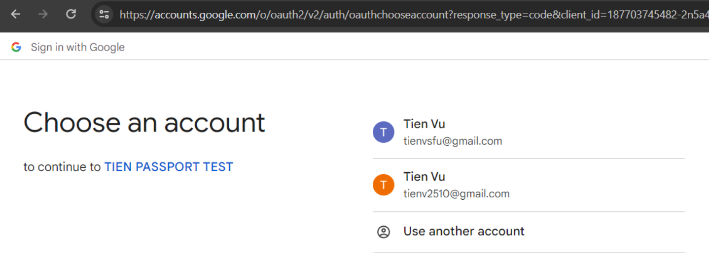

This is the end result after logging in

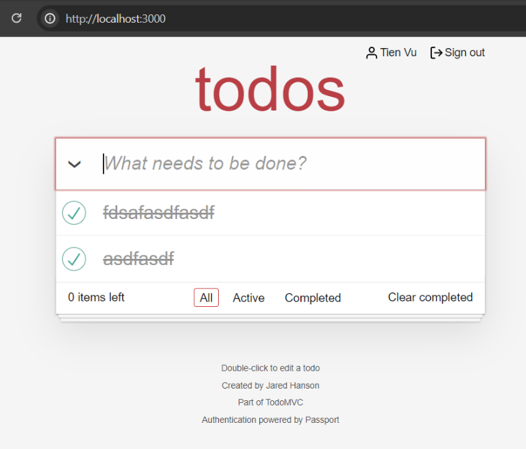

Here's what's going on

1. **Initialization**: You initialize Passport.js in your Node.js application and configure it to use the OIDC strategy for Google authentication.
2. **Redirect to Google**: When a user attempts to authenticate with your application `"/login/federated/google"`, you redirect them to https://accounts.google.com, passing along your application's client ID, client secret, and redirect URI.
   a. Notice the `&scope=openid%20profile` parameter in the URL. openid indicates that the application is initiating an OpenID Connect authentication flow, and that our application would like to request the user's basic identity information (say name, email)
3. **Google Authentication**: `accounts.google.com` will do it's authentication thing. If the user rejects the login request, nothing interesting happens and we just land back in our app. If the login request succeeds, the browser sends a redirect to `http://localhost:3000/oauth2/redirect/google`

You can actually see this in the Network tab

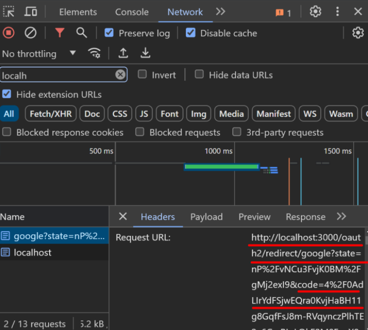

4. **Exchange Authorization Code for Tokens**: Your application receives the `Authorization code` from Google (highlighted above). It then makes a POST request to Google's `token` endpoint, passing the authorization code, client ID, client secret, redirect URI, and grant type to exchange the `Authorization code` for the `access token`.

5. **Fetching User Profile from Google**: PassportJS uses the `access token` from the last step to retrieve user Profile information from Google. This concludes any interaction we have with Google

6. **Session management**: After identifying with Google "this person is X", we setup a 1:1 mapping between `X` and their associated Session in the datastore

   a. **getOrCreateUserFromDb**: From the `User Profile` object in step 5, PassportJS runs the `verify` function [here](https://github.com/passport/todos-express-google/blob/main/routes/auth.js#L19). This maps the Google User to "our" user. If this user exists in our DB, we grab their details, otherwise we make a new row in the DB

   > [!NOTE]
   > The Express Session middleware automagically creates the Session ID for you. You just decide what to put in the Session Datastore via `serialize`, this is the data that will be associated with this Session ID onwards

   b. `serialize`: The `User` we fetched from our DB in the last step might contain a lot of information (think user ID, name, birthday, etc...). We choose how much of this `User` information to [serialize](https://github.com/passport/todos-express-google/blob/main/routes/auth.js#L19) to our DB. PassportJS then sends back to the client a Cookie with the `session ID` (NOT the serialized user info: the `Map[session ID -> serializedUserData]` is stored in the Database only). Along with the `Location = /`, this concludes the request to `http://localhost:3000/oauth2/redirect/google` from step 3

   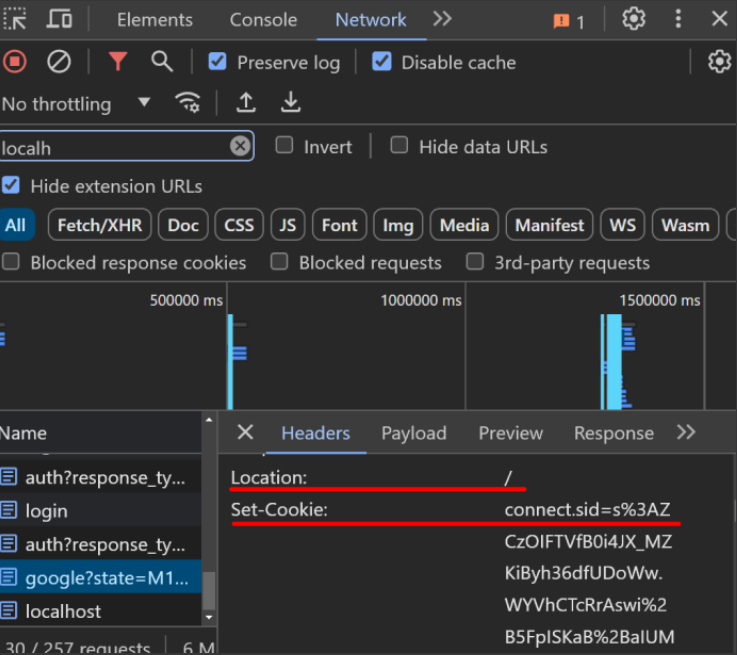

   c. **Redirect to "/"**: For subsequent requests to `"/"`, Passport.js middleware checks if the user is authenticated by checking the Session ID represented by the Cookie (notice that it's the same `3AZCzOI` cookie as above)

   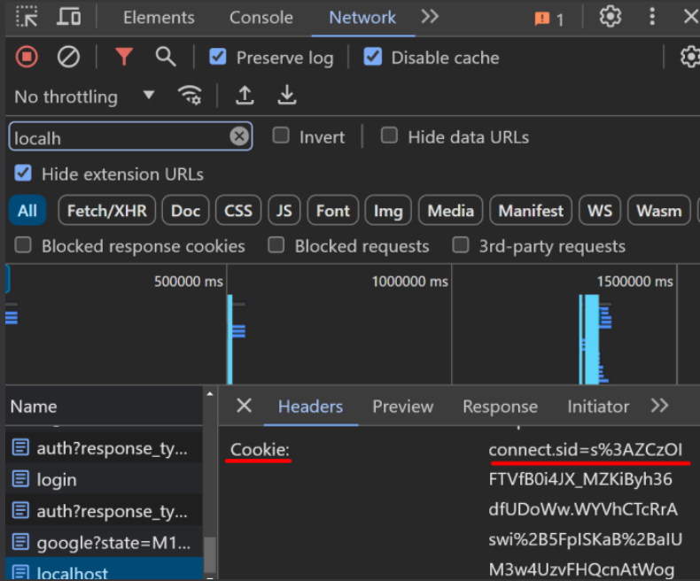

   If Passport detects that the Session ID in the Cookie is present in the Session Datastore, it will grab the associated `serialized User object` that we `serialized` above. [passport.deserialize](https://github.com/passport/todos-express-google/blob/main/routes/auth.js#L71) is called on this `serialized User object`, to fetch further data as needed. **The result of this deserialization is stored into the `req.user` object**

Now your user is logged in!

### The actual exercise: Implement OIDC Authentication yourself

Clone the [starter app](https://github.com/TienSFU25/2650-express-starter) into a new directory `2650-oidc-google-exercise`. _Pattern match_ whatever is necessary from the `todos-express-google` example so that you are able to log into Google, and the app shows your Google username.

Here's what the end result of your implementation should look like

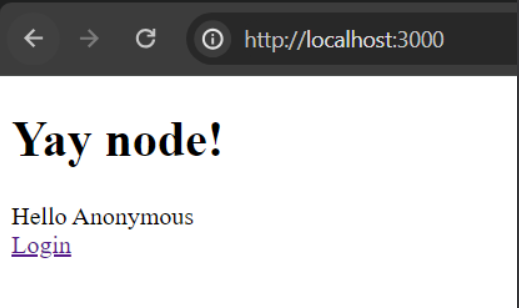

Clicking on Login

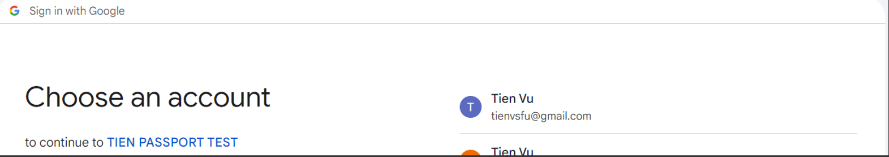

After consenting the app to retrieve your data from Google

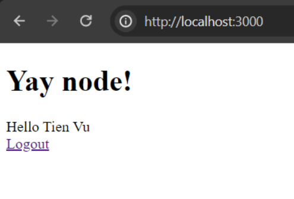

After clicking on Logout

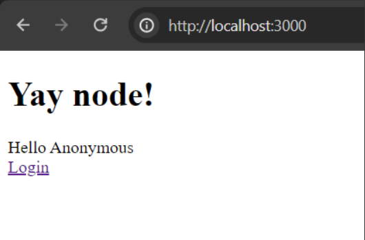

#### What do we copy paste over?

Part of the ask of this exercise is to deal with the ambiguity of another person's code, and seeing whether you can derive where are the useful parts. Here are some hints

- `db.js`. This file creates the `user`, `federated_credentials` and `todos` tables. I'm not asking you to make a todo list, however the other 2 tables are probably useful. `federated_credentials` represents a DB setup where a User could login with multiple providers (Facebook, Google, Microsoft...), but in this exercise we'll assume you can only login with Google
- `auth.js`. You'll need pretty much everything in this file
- `app.js`. Everything except the csrf stuff

#### Replace SQLite with MongoDB

The sample code uses [SQLite](https://github.com/passport/todos-express-google/blob/e63651dcf4e0ce57272c576256566e222599011e/routes/auth.js#L26), to store both the `User` table and the `User <> Google` table. Go ahead and remove all that, and replace it with calls to Mongo instead.

#### Replace SQLite Session with Redis

Lets try to make this app a little more realistic, by using Redis to store Session data, instead of SQLite (notice the /`var/db/session.db` file, that's storing the Session info).

> [!NOTE]
> If you haven't installed Redis already (we should have covered this in week 5), please to so https://redis.io/docs/latest/operate/oss_and_stack/install/install-redis/install-redis-on-linux/

`redis-server` to spin up a local Redis server

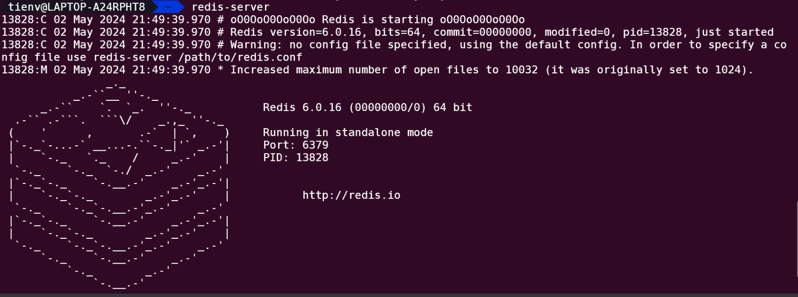

After Redis is up and running, replace the `connect-sqlite3` middleware [here](https://github.com/passport/todos-express-google/blob/e63651dcf4e0ce57272c576256566e222599011e/app.js#L14C28-L14C43) with [connect-redis](https://github.com/tj/connect-redis) instead. The example in the Github should give you enough context.

If things work together properly, you should see some Session IDs stored in Redis. One for each user

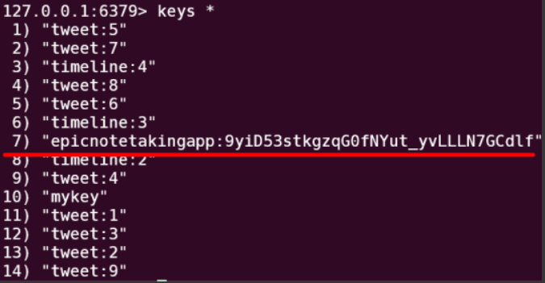

#### Change passport.serializeUser and passport.deserializeUser

Note the comment [here](https://github.com/passport/todos-express-google/blob/e63651dcf4e0ce57272c576256566e222599011e/routes/auth.js#L56)

The sample implementation serializes the all of the User's ID, username and name into SQLite (that we've replaced with Redis). We want to change this so that only the `userId` is stored in Redis (the `userId` that uniquely identifies a User in your app, not the Google user ID)

To print what's currently stored in the Redis session store, copy paste this code in

```js
app.get("/print-sessions", (req, res) => {
  const sessionStore = req.sessionStore;
  sessionStore.all((err, sessions) => {
    if (err) {
      console.error("Error fetching sessions:", err);
      res.status(500).send("Failed to fetch sessions");
      return;
    }
    res.send(sessions);
  });
});
```

Update `serializeUser` and `deserializeUser` to store only the `userID` in Redis. For example, this should be the output of `/print-sessions`: only `userID` is stored, not `{ username, id, name }`

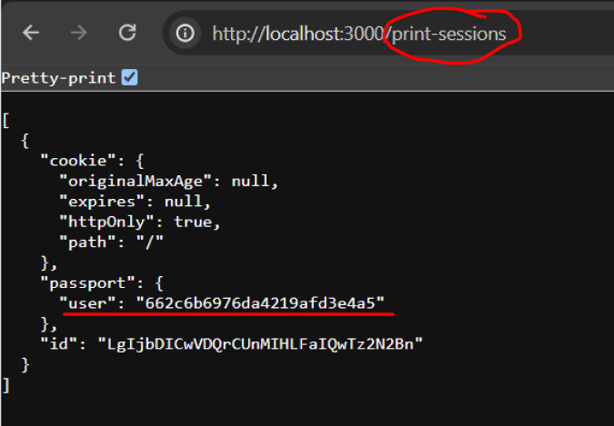

## Checklist

- OpenID Connect using Google/PassportJS works
- UI shows user name
- Mongo > SQLite for storing User info
- Redis session storage
- `serialize` only a persistently stores a user ID, `deserialize` fetches user using user ID

## Grading

- 3/3: "nice!"
  - Exceptional work with all tasks completed satisfactorily according to the specification
  - Efficient, well-designed, and well-coded
- 2/3: "satisfactory"
  - Most tasks completed, but a few key things missing
  - Some inefficiencies in the implementation, or deviation from the specification
- 1/3: "it barely works"
  - Some progress made, but major deficiencies in solution
  - Many tasks missed or major deviation from specification
- 0/3: "you didn't do much"
  - Little or no progress
  - Few points from specification implemented

Note that up to -0.5 may be deducted for improper hand in, disorganized files or code, etc. Please ask me if in doubt.

## Other references

https://www.youtube.com/watch?v=CHzERullHe8&t=5s

https://www.youtube.com/watch?v=996OiexHze0&ab_channel=OktaDev

https://developer.okta.com/blog/2019/05/01/is-the-oauth-implicit-flow-dead

https://github.com/aaronpk/pkce-vanilla-js
